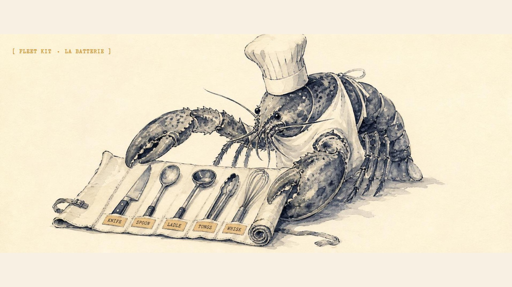
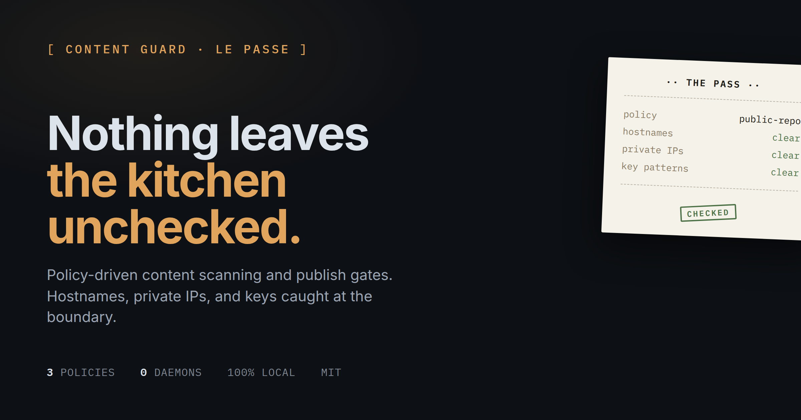

<p align="center">
  
</p>

<h1 align="center">escoffier-fleet-kit</h1>

<p align="center">
  <strong>Shared theme and routine maintenance for the Escoffier Labs website fleet. One template, every site, always current.</strong>
</p>

<p align="center">
  
  
  
</p>

Shared theme and routine maintenance for the Escoffier Labs website fleet. One
place to keep every `*-site` looking the same and staying current, so the
sites do not drift and do not need a hand-driven LLM session to update.

<p align="center">
  
</p>
<p align="center"><em>One template, every site. This is content-guard's card, rendered by <code>og/render.mjs</code> from <code>og/template.html</code> + <code>og/sites.json</code>.</em></p>

## What it does

- **One OG preview theme.** Every site's link-preview card is rendered from a
  single template (`og/template.html`) and a content map (`og/sites.json`), in
  the shared dark-ledger kitchen style. Change the theme once, regenerate all.
- **Version sync.** Reads each tool's latest GitHub release (or skill count)
  and writes it into that site's `SITE.version`, so the sites never lag the
  tools they market.
- **Hands-off publishing.** `bin/fleet-sync.sh` fast-forwards each checkout,
  syncs versions, regenerates the cards, and commits and pushes only the repos
  that actually changed. Safe to run on a timer; a no-op run touches nothing.
- **Tool publishing watchdog.** `bin/publishing-watchdog.mjs` reads
  `publishing/manifest.json`, checks local source state, pulls live ClawHub
  stats for published skills, and prints a Discord-ready report with a JSON
  receipt.
- **Content-aware (review-gated).** `bin/content-sync.mjs` detects new
  releases, drafts a one-line kitchen-voice blurb from each changelog (via
  `codex exec`), refreshes the "fresh from the kitchen" specials board on
  escoffierlabs.dev, and opens ONE review PR plus a Discord ping. It never
  pushes copy to main: an LLM-drafted line always gets a human merge. Idempotent
  (one draft per release, cached in `.content-state.json`), with a graceful
  fallback when a changelog is too thin to summarize.

- **Reusable React islands (opt-in).** `fleet/islands/` holds the glue that
  makes Justin Levine's jal-co/ui components drop into a fleet Astro site,
  themed to the ledger palette: a shadcn token bridge, build-time GitHub
  fetchers, a static badge composition, and a shieldcn chart wrapper.
  `bin/adopt-islands.sh <site>` copies it in; `docs/ISLANDS.md` is the recipe.
  Proven on brigade.tools/blog (commit-graph timeline + release/CI badges).

The canonical design system lives in `DESIGN.md` (copied into each site repo).
The fleet README contract, section order, proof conventions, badges, lives in
`README-SPINE.md`.

## Layout

```
DESIGN.md            canonical aesthetic reference for every fleet site
README-SPINE.md      the fleet README contract: section order, proof, badges
sites.config.json    per-site version source (gh-release | skill-count | manual)
og/
  template.html      the one OG card template (dark ledger + cream artifact)
  sites.json         per-site OG copy (kicker, headline, subtitle, footer, card)
  render.mjs         renders cards to each repo's public/og-card.png (2x, no server)
fleet/
  FleetLinks.astro   shared cross-link section, synced into every site
  fleet.ts           the site registry FleetLinks reads
  islands/           jal-co/ui island glue (opt-in per site, see docs/ISLANDS.md)
    shadcn-alias.css   shadcn -> ledger token bridge (islands theme for free)
    github-data.ts     build-time GitHub fetchers (commits, release, CI)
    JalcoProjectBadgesStatic.tsx  static release + CI badges
    ShieldcnChart.astro           dark/light shieldcn chart wrapper
docs/
  ISLANDS.md         recipe: add jal-co/ui React islands to a fleet Astro site
bin/
  sync-versions.mjs  read tool versions, patch SITE.version in each site repo
  fleet-sync.sh      the headless routine: pull, sync, render, commit, push
  adopt-islands.sh   copy the island glue into a site, then follow ISLANDS.md
  publishing-watchdog.mjs  ClawHub/Printing Press publishing status report
publishing/
  manifest.json      public skill and CLI publishing inventory
```

## Use

```bash
npm install                 # playwright-core (uses an existing Chromium build)

npm run og                  # regenerate every OG card from the shared theme
npm run og -- skillet-site  # just one
npm run sync:dry            # preview version changes, write nothing
npm run sync                # apply version bumps into each site repo
npm run fleet               # the full routine: pull + sync + render + commit + push
npm run publishing:watch    # report ClawHub/Printing Press publishing status
```

## Adding a site

1. Add an entry to `og/sites.json` (kicker, h1, h2, sub, foot, card).
2. Add an entry to `sites.config.json` (repo + version source).
3. Run `npm run og -- <slug>` to render its card.

## Routine automation

`bin/fleet-sync.sh` is meant to run unattended (cron or an OpenClaw scheduled
job). It only pushes repos with real changes and prints a one-line-per-repo
summary suitable for relaying to a chat channel. New release out? The next run
bumps the site and redeploys via Vercel, no terminal required.

The sites all deploy on Vercel from `git push` to their default branch, so a
push from this kit is a deploy.

## Publishing watchdog

`publishing/manifest.json` is the source of truth for public skill and CLI
publishing. Entries track the source repo/path, current status, publish policy,
published version, source commit, and any blocker such as a taken ClawHub slug
or a rate-limit retry.

`npm run publishing:watch` writes receipts under the current user's OpenClaw
workspace logs and prints a short report for Discord. OpenClaw runs it weekly
into the private `#escoffier-stats` channel on Solomon's machine.
